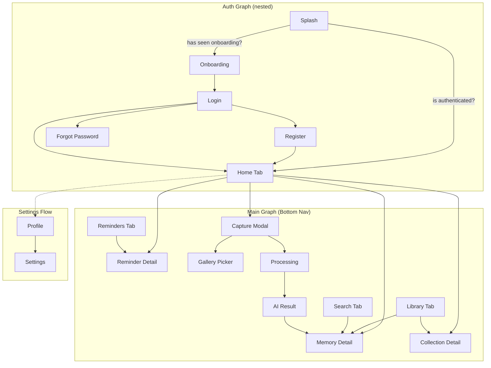

# Memora — Android System Architecture

**Founding Engineer's Blueprint · v2.0**

> [!NOTE]
> **v2.0 Changelog** — Incorporates all 9 improvements from founder review:
> 1. "Memory Feed" → "Library" rename
> 2. Smart Collections (AI-generated)
> 3. AI Confidence scoring on every extracted field
> 4. Edit versioning with revert capability
> 5. Expanded AI API contract
> 6. Smart Actions (context-aware entity actions)
> 7. Search ranking (multi-signal scoring)
> 8. App shortcuts (launcher shortcuts)
> 9. Widgets (v2 architectural placeholder)
> 10. Capture flow redesigned (compress → upload → analyze as separate stages)

---

## 1. Module Structure

Memora uses a **multi-module Gradle project** to enforce layer boundaries at compile time.

```
memora/                          (root project)
├── app/                         (application module — wiring only)
├── core/
│   ├── core-ui/                 (design system, theme, shared composables)
│   ├── core-common/             (extensions, utilities, result types)
│   ├── core-network/            (Retrofit setup, interceptors, API error handling)
│   ├── core-database/           (Room database, DAOs, type converters)
│   ├── core-datastore/          (DataStore preferences)
│   ├── core-firebase/           (Firebase wrappers — Auth, Firestore, Storage, FCM)
│   ├── core-model/              (domain models — pure Kotlin, no Android deps)
│   └── core-testing/            (shared test utilities, fakes, fixtures)
├── feature/
│   ├── feature-splash/
│   ├── feature-onboarding/
│   ├── feature-auth/
│   ├── feature-home/
│   ├── feature-capture/
│   ├── feature-processing/
│   ├── feature-result/
│   ├── feature-library/         (renamed from feature-memory-feed)
│   ├── feature-memory-detail/
│   ├── feature-collections/     (NEW — smart collections)
│   ├── feature-search/
│   ├── feature-reminders/
│   ├── feature-profile/
│   └── feature-settings/
└── build-logic/                 (convention plugins for consistent Gradle config)
    └── convention/
```

### Module Dependency Rules

```mermaid
graph TD
    APP[app] --> F_SPLASH[feature-splash]
    APP --> F_ONBOARD[feature-onboarding]
    APP --> F_AUTH[feature-auth]
    APP --> F_HOME[feature-home]
    APP --> F_CAPTURE[feature-capture]
    APP --> F_PROCESSING[feature-processing]
    APP --> F_RESULT[feature-result]
    APP --> F_LIBRARY[feature-library]
    APP --> F_DETAIL[feature-memory-detail]
    APP --> F_COLLECTIONS[feature-collections]
    APP --> F_SEARCH[feature-search]
    APP --> F_REMIND[feature-reminders]
    APP --> F_PROFILE[feature-profile]
    APP --> F_SETTINGS[feature-settings]

    F_SPLASH --> C_UI[core-ui]
    F_ONBOARD --> C_UI
    F_AUTH --> C_UI
    F_AUTH --> C_FIREBASE[core-firebase]
    F_HOME --> C_UI
    F_HOME --> C_MODEL[core-model]
    F_CAPTURE --> C_UI
    F_PROCESSING --> C_UI
    F_PROCESSING --> C_NETWORK[core-network]
    F_PROCESSING --> C_FIREBASE
    F_RESULT --> C_UI
    F_RESULT --> C_MODEL
    F_LIBRARY --> C_UI
    F_LIBRARY --> C_MODEL
    F_DETAIL --> C_UI
    F_DETAIL --> C_MODEL
    F_COLLECTIONS --> C_UI
    F_COLLECTIONS --> C_MODEL
    F_SEARCH --> C_UI
    F_SEARCH --> C_MODEL
    F_REMIND --> C_UI
    F_REMIND --> C_MODEL
    F_PROFILE --> C_UI
    F_PROFILE --> C_FIREBASE
    F_SETTINGS --> C_UI
    F_SETTINGS --> C_DATASTORE[core-datastore]

    C_UI --> C_MODEL
    C_UI --> C_COMMON[core-common]
    C_NETWORK --> C_COMMON
    C_DATABASE[core-database] --> C_MODEL
    C_FIREBASE --> C_MODEL
    C_FIREBASE --> C_COMMON
    C_DATASTORE --> C_COMMON
```



**Critical rule:** Feature modules NEVER depend on other feature modules. All shared logic flows through `core-*` modules. The `app` module is the only module that sees all features — it wires the navigation graph.

---

## 2. Folder Structure (Per Feature Module)

Every feature module follows identical internal structure. Using `feature-home` as an example:

```
feature-home/
├── src/main/kotlin/com/memora/feature/home/
│   ├── navigation/
│   │   └── HomeNavigation.kt          (route definition + NavGraphBuilder extension)
│   ├── data/
│   │   ├── repository/
│   │   │   └── HomeRepositoryImpl.kt
│   │   ├── remote/
│   │   │   └── HomeRemoteDataSource.kt
│   │   └── local/
│   │       └── HomeLocalDataSource.kt
│   ├── domain/
│   │   ├── repository/
│   │   │   └── HomeRepository.kt      (interface)
│   │   ├── usecase/
│   │   │   ├── GetRecentMemoriesUseCase.kt
│   │   │   ├── GetUpcomingRemindersUseCase.kt
│   │   │   ├── GetSmartCollectionsUseCase.kt
│   │   │   └── GetGreetingUseCase.kt
│   │   └── model/
│   │       └── (feature-specific domain models if any)
│   ├── presentation/
│   │   ├── HomeScreen.kt              (composable — UI only)
│   │   ├── HomeViewModel.kt
│   │   ├── HomeUiState.kt             (sealed interface)
│   │   ├── HomeUiEvent.kt             (one-shot events)
│   │   └── components/
│   │       ├── GreetingSection.kt
│   │       ├── RecentMemoriesSection.kt
│   │       ├── UpcomingRemindersSection.kt
│   │       ├── SmartCollectionsRow.kt
│   │       └── SearchBar.kt
│   └── di/
│       └── HomeModule.kt              (Hilt module)
└── src/test/kotlin/com/memora/feature/home/
    ├── domain/usecase/
    └── presentation/
```

### Core Module Structures

```
core-model/
└── src/main/kotlin/com/memora/core/model/
    ├── Memory.kt
    ├── MemoryVersion.kt           (NEW — edit history)
    ├── Reminder.kt
    ├── User.kt
    ├── Category.kt                (enum)
    ├── ExtractedEntity.kt         (extracted entity with confidence)
    ├── ConfidenceField.kt         (NEW — wrapper for value + confidence)
    ├── SmartAction.kt             (NEW — context-aware actions)
    ├── SmartCollection.kt         (NEW — AI-generated collections)
    ├── Tag.kt
    ├── SearchResult.kt
    ├── SearchRank.kt              (NEW — ranking signals)
    ├── Notification.kt
    └── Settings.kt

core-network/
└── src/main/kotlin/com/memora/core/network/
    ├── MemoraApi.kt               (Retrofit interface)
    ├── dto/
    │   ├── AnalyzeResponseDto.kt  (EXPANDED — confidence, actions, reminders)
    │   ├── EntityDto.kt           (UPDATED — includes confidence)
    │   ├── ActionDto.kt           (NEW)
    │   ├── ReminderSuggestionDto.kt (NEW)
    │   └── TagDto.kt
    ├── mapper/
    │   └── NetworkMapper.kt
    ├── interceptor/
    │   ├── AuthInterceptor.kt
    │   └── ConnectivityInterceptor.kt
    ├── di/
    │   └── NetworkModule.kt
    └── util/
        ├── NetworkMonitor.kt
        └── ImageCompressor.kt     (NEW — compress before upload)

core-database/
└── src/main/kotlin/com/memora/core/database/
    ├── MemoraDatabase.kt
    ├── dao/
    │   ├── MemoryDao.kt
    │   ├── MemoryVersionDao.kt    (NEW — edit history)
    │   ├── ReminderDao.kt
    │   ├── SearchHistoryDao.kt
    │   ├── CollectionDao.kt       (NEW — smart collections)
    │   └── NotificationDao.kt
    ├── entity/
    │   ├── MemoryEntity.kt        (UPDATED — confidence, actions, isFavorite, isArchived)
    │   ├── MemoryVersionEntity.kt (NEW)
    │   ├── ReminderEntity.kt
    │   ├── SearchHistoryEntity.kt
    │   ├── CollectionEntity.kt    (NEW)
    │   └── NotificationEntity.kt
    ├── mapper/
    │   └── DatabaseMapper.kt
    ├── converter/
    │   └── TypeConverters.kt
    └── di/
        └── DatabaseModule.kt

core-firebase/
└── src/main/kotlin/com/memora/core/firebase/
    ├── auth/
    │   ├── FirebaseAuthService.kt       (interface)
    │   └── FirebaseAuthServiceImpl.kt
    ├── firestore/
    │   ├── FirestoreService.kt          (interface)
    │   └── FirestoreServiceImpl.kt
    ├── storage/
    │   ├── FirebaseStorageService.kt    (interface)
    │   └── FirebaseStorageServiceImpl.kt
    ├── messaging/
    │   ├── MemoraMessagingService.kt
    │   └── NotificationHelper.kt
    ├── analytics/
    │   └── AnalyticsService.kt
    └── di/
        └── FirebaseModule.kt

core-ui/
└── src/main/kotlin/com/memora/core/ui/
    ├── theme/
    │   ├── Theme.kt
    │   ├── Color.kt
    │   ├── Type.kt
    │   ├── Shape.kt
    │   ├── Spacing.kt
    │   ├── Elevation.kt
    │   └── Animation.kt
    ├── components/
    │   ├── MemoraButton.kt
    │   ├── MemoraCard.kt
    │   ├── MemoraTextField.kt
    │   ├── MemoraTopBar.kt
    │   ├── MemoraBottomBar.kt
    │   ├── MemoraCaptureButton.kt
    │   ├── MemoraChip.kt
    │   ├── MemoraBadge.kt
    │   ├── MemoraConfidenceBadge.kt   (NEW — shows confidence with color coding)
    │   ├── MemoraActionChip.kt        (NEW — smart action chips)
    │   ├── MemoraBottomSheet.kt
    │   ├── MemoraDialog.kt
    │   ├── MemoraLoadingIndicator.kt
    │   ├── MemoraProgressBar.kt       (NEW — multi-stage progress)
    │   ├── MemoraSkeletonLoader.kt
    │   ├── MemoraEmptyState.kt
    │   ├── MemoraErrorState.kt
    │   ├── MemoraOfflineBanner.kt
    │   ├── MemoraToast.kt
    │   └── MemoraImage.kt
    ├── icon/
    │   └── MemoraIcons.kt             (centralised icon references)
    └── util/
        ├── ModifierExtensions.kt
        └── AnimationSpecs.kt

core-common/
└── src/main/kotlin/com/memora/core/common/
    ├── result/
    │   └── Result.kt                  (sealed class: Success, Error, Loading)
    ├── extension/
    │   ├── StringExtensions.kt
    │   ├── DateExtensions.kt
    │   └── FlowExtensions.kt
    ├── dispatcher/
    │   ├── DispatcherProvider.kt       (interface)
    │   └── DefaultDispatcherProvider.kt
    ├── constant/
    │   └── Constants.kt
    └── di/
        └── CommonModule.kt

core-datastore/
└── src/main/kotlin/com/memora/core/datastore/
    ├── MemoraPreferences.kt           (interface)
    ├── MemoraPreferencesImpl.kt
    ├── model/
    │   └── UserPreferences.kt
    └── di/
        └── DataStoreModule.kt
```

---

## 3. Navigation Graph

### Route Definitions

```kotlin
sealed interface MemoraRoute {
    // Auth flow
    @Serializable data object Splash : MemoraRoute
    @Serializable data object Onboarding : MemoraRoute
    @Serializable data object Login : MemoraRoute
    @Serializable data object Register : MemoraRoute
    @Serializable data object ForgotPassword : MemoraRoute

    // Main app flow
    @Serializable data object Home : MemoraRoute
    @Serializable data object Capture : MemoraRoute
    @Serializable data object GalleryPicker : MemoraRoute
    @Serializable data class Processing(val imageUri: String) : MemoraRoute
    @Serializable data class Result(val memoryId: String) : MemoraRoute
    @Serializable data object Library : MemoraRoute               // renamed from MemoryFeed
    @Serializable data class MemoryDetail(val memoryId: String) : MemoraRoute
    @Serializable data object Collections : MemoraRoute            // NEW
    @Serializable data class CollectionDetail(
        val collectionType: String,                                // smart collection identifier
    ) : MemoraRoute                                                // NEW
    @Serializable data object Search : MemoraRoute
    @Serializable data object Reminders : MemoraRoute
    @Serializable data object Profile : MemoraRoute
    @Serializable data object Settings : MemoraRoute
}
```

### Navigation Architecture



### Bottom Navigation Tabs

| Tab | Icon | Label | Route |
|---|---|---|---|
| Home | `house` (outline) | Home | `MemoraRoute.Home` |
| Library | `layers` (outline) | Library | `MemoraRoute.Library` |
| *(Capture)* | Filled circle | — | Opens `MemoraRoute.Capture` as modal |
| Search | `search` (outline) | Search | `MemoraRoute.Search` |
| Reminders | `bell` (outline) | Reminders | `MemoraRoute.Reminders` |

The Capture button is **not a standard tab**. It is a visually elevated centre button that opens the camera as a full-screen modal, not as a tab destination.

> [!NOTE]
> Profile is accessed from Home (top-right avatar), not as a bottom tab. This keeps the tab bar focused on the 4 primary surfaces + capture action.

---

## 4. Screen Flow (Detailed)

### 4.1 — First Launch

```
App Launch
  → Splash (check auth state, 800ms minimum for brand moment)
    → If first launch:  Onboarding (3 pages, horizontal pager)
      → Login Screen
        → User taps "Create Account" → Register Screen
        → User taps "Forgot Password" → Forgot Password Screen
        → User logs in → Home (clear backstack)
    → If returning user (token valid): Home (clear backstack)
    → If returning user (token expired): Login (clear backstack)
```

### 4.2 — Capture Flow (Redesigned)

```
User taps Capture Button (from any tab)
  → Camera Screen (full-screen modal, slide-up)
    → User takes photo OR taps gallery icon
      → If gallery: Gallery Picker → selected image
    → Preview with Retake / Use Photo
      → Optional crop
    → Processing Screen (multi-stage)
      ┌─────────────────────────────────────────────┐
      │ Stage 1: COMPRESSING                        │
      │   → Compress image (quality 85%, max 2048px)│
      │   → Progress: deterministic (fast, ~500ms)  │
      │                                             │
      │ Stage 2: UPLOADING                          │
      │   → Upload to Firebase Storage              │
      │   → Progress: real upload percentage (0-100)│
      │   → Shows: "Uploading image…"               │
      │                                             │
      │ Stage 3: ANALYZING                          │
      │   → POST compressed image to /analyze       │
      │   → Progress: indeterminate                 │
      │   → Shows: "Understanding your capture…"    │
      │                                             │
      │ Stage 4: COMPLETE                           │
      │   → AI response received                    │
      │   → Card animation → transition to Result   │
      └─────────────────────────────────────────────┘
    → AI Result Screen
      → Display: title, summary, category, tags, entities
      → Each entity shows confidence badge
      → Low-confidence fields (< 70%) highlighted in amber
        → "Verify this" prompt appears beside low-confidence items
      → Smart Actions shown as actionable chips below entities
      → AI-suggested reminders shown with accept/dismiss
      → User can edit any field
        → Edits are tracked as a new MemoryVersion
      → User taps "Save Memory"
        → Memory saved to Firestore + Room
        → Navigate to Memory Detail
          OR
        → User taps back → Home (memory still auto-saved)
```

### 4.3 — Daily Usage Loop

```
User opens app → Home
  → Sees greeting, recent memories, upcoming reminders, smart collections row
  → Taps a memory card → Memory Detail
  → Taps a smart collection (e.g., "This Week") → Collection Detail (filtered list)
  → Taps search bar → Search Tab
    → Types natural language query → Ranked results
    → Taps result → Memory Detail
  → Taps reminder banner → Reminders Tab
  → Taps Capture → Capture Flow
  → Taps Library tab → Full memory library (grouped by date)
```

---

## 5. Design System Architecture

The design system lives in `core-ui` and is the **single source of truth** for all visual decisions. No feature module defines its own colors, shapes, or typography.

### 5.1 — Theme Structure

```kotlin
@Composable
fun MemoraTheme(
    darkTheme: Boolean = isSystemInDarkTheme(),
    content: @Composable () -> Unit
) {
    val colorScheme = if (darkTheme) MemoraDarkColorScheme else MemoraLightColorScheme
    val typography = MemoraTypography
    val shapes = MemoraShapes
    val spacing = MemoraSpacing
    val elevation = MemoraElevation

    CompositionLocalProvider(
        LocalMemoraSpacing provides spacing,
        LocalMemoraElevation provides elevation,
        LocalMemoraAnimation provides MemoraAnimationSpecs,
    ) {
        MaterialTheme(
            colorScheme = colorScheme,
            typography = typography,
            shapes = shapes,
            content = content
        )
    }
}
```

### 5.2 — Color Tokens

```
Light Mode:
  Primary:          #4F46E5 (indigo-600)
  OnPrimary:        #FFFFFF
  PrimaryContainer: #EEF2FF (indigo-50)
  Secondary:        #06B6D4 (cyan-500)
  Accent:           #8B5CF6 (violet-500) — AI content marker
  Background:       #F8FAFC (slate-50)
  Surface:          #FFFFFF
  SurfaceVariant:   #F1F5F9 (slate-100)
  OnBackground:     #0F172A (slate-900)
  OnSurface:        #0F172A
  OnSurfaceVariant: #475569 (slate-600)
  Outline:          #E2E8F0 (slate-200)
  OutlineVariant:   #F1F5F9 (slate-100)
  Success:          #10B981
  Warning:          #F59E0B — also used for low-confidence highlights
  Error:            #EF4444
  ConfidenceHigh:   #10B981 (green — ≥ 90%)
  ConfidenceMedium: #F59E0B (amber — 70-89%)
  ConfidenceLow:    #EF4444 (red — < 70%)

Dark Mode:
  Primary:          #818CF8 (indigo-400)
  OnPrimary:        #1E1B4B
  PrimaryContainer: #1E1B4B (indigo-950)
  Background:       #111827 (gray-900)
  Surface:          #1F2937 (gray-800)
  SurfaceVariant:   #374151 (gray-700)
  OnBackground:     #F9FAFB (gray-50)
  OnSurface:        #F9FAFB
  OnSurfaceVariant: #9CA3AF (gray-400)
  Outline:          #374151 (gray-700)
  OutlineVariant:   #1F2937 (gray-800)
  ConfidenceHigh:   #34D399
  ConfidenceMedium: #FBBF24
  ConfidenceLow:    #F87171
```

### 5.3 — Typography Tokens

```
Font family: Inter (Google Fonts, variable weight)
Fallback:    system default sans-serif

Display:     32sp / Bold (700)    / lineHeight 38sp / letterSpacing -0.02em
Title:       24sp / SemiBold (600) / lineHeight 31sp / letterSpacing -0.015em
Heading:     20sp / SemiBold (600) / lineHeight 27sp / letterSpacing -0.01em
Subheading:  16sp / SemiBold (600) / lineHeight 22sp / letterSpacing -0.005em
Body:        15sp / Regular (400)  / lineHeight 24sp / letterSpacing 0
BodySmall:   13sp / Regular (400)  / lineHeight 19sp / letterSpacing 0.005em
Caption:     11sp / Medium (500)   / lineHeight 15sp / letterSpacing 0.02em
```

### 5.4 — Spacing Tokens (4px grid)

```
space1  =  4.dp
space2  =  8.dp
space3  = 12.dp
space4  = 16.dp
space5  = 20.dp
space6  = 24.dp
space8  = 32.dp
space10 = 40.dp
space12 = 48.dp
space16 = 64.dp
space20 = 80.dp
```

### 5.5 — Shape Tokens

```
small  =  8.dp  (chips, badges)
medium = 12.dp  (inputs, small cards)
large  = 16.dp  (standard cards)
xLarge = 20.dp  (modals, large cards)
full   = 50%    (pills, avatars)
```

### 5.6 — Elevation / Shadow Tokens

```
Level0: 0.dp   (flat)
Level1: 1.dp   (list items)
Level2: 2.dp   (cards resting)
Level3: 4.dp   (hovered cards)
Level4: 8.dp   (sheets)
Level5: 16.dp  (modals)
```

### 5.7 — Animation Specs

```
DurationInstant  = 100ms
DurationFast     = 150ms
DurationNormal   = 250ms
DurationSlow     = 350ms

EaseOut          = CubicBezierEasing(0.16f, 1f, 0.3f, 1f)
EaseInOut        = CubicBezierEasing(0.65f, 0f, 0.35f, 1f)
EaseSpring       = spring(dampingRatio = 0.7f, stiffness = 400f)
```

---

## 6. Firebase Architecture

### 6.1 — Firestore Schema

```
/users/{userId}
  ├── displayName: String
  ├── email: String
  ├── photoUrl: String?
  ├── createdAt: Timestamp
  ├── updatedAt: Timestamp
  └── settings: Map
        ├── darkMode: String          ("system" | "light" | "dark")
        ├── notificationsEnabled: Boolean
        ├── language: String
        └── backupEnabled: Boolean

/users/{userId}/memories/{memoryId}
  ├── id: String
  ├── imageUrl: String
  ├── thumbnailUrl: String
  ├── title: String
  ├── summary: String
  ├── category: String               (enum name)
  ├── importance: Double              (0.0 – 1.0)
  ├── overallConfidence: Double       (NEW — 0.0 – 1.0)
  ├── detectedLanguage: String        (NEW — ISO 639-1, e.g. "en")
  ├── tags: List<String>
  ├── entities: List<Map>
  │     ├── type: String              ("date"|"contact"|"address"|"url"|"amount"|"qr_code")
  │     ├── value: String
  │     ├── label: String?
  │     └── confidence: Double        (NEW — 0.0 – 1.0)
  ├── actions: List<Map>              (NEW — smart actions)
  │     ├── type: String              ("open_url"|"call"|"email"|"open_maps"|"add_reminder"|"open_link")
  │     ├── label: String
  │     ├── value: String             (the URL/phone/email/address)
  │     └── entityIndex: Int          (references entities array index)
  ├── suggestedReminders: List<Map>   (NEW — AI-suggested reminders)
  │     ├── title: String
  │     ├── dateTime: String          (ISO 8601)
  │     └── accepted: Boolean
  ├── relatedCategories: List<String> (NEW)
  ├── extractedDate: String?          (ISO 8601)
  ├── extractedTime: String?
  ├── extractedLocation: String?
  ├── capturedAt: Timestamp
  ├── createdAt: Timestamp
  ├── updatedAt: Timestamp
  ├── isSynced: Boolean
  ├── isDeleted: Boolean              (soft delete)
  ├── isFavorite: Boolean             (NEW)
  ├── isArchived: Boolean             (NEW)
  ├── viewCount: Int                  (NEW — for search ranking)
  └── lastViewedAt: Timestamp?        (NEW — for search ranking)

/users/{userId}/memories/{memoryId}/versions/{versionId}   (NEW — edit history)
  ├── id: String
  ├── editedAt: Timestamp
  ├── editedBy: String                ("ai" | "user")
  ├── fields: Map                     (snapshot of all editable fields at this point)
  │     ├── title: String
  │     ├── summary: String
  │     ├── category: String
  │     ├── tags: List<String>
  │     └── entities: List<Map>
  └── changeDescription: String?      (optional, e.g. "Changed category from Notice to Event")

/users/{userId}/reminders/{reminderId}
  ├── id: String
  ├── memoryId: String                (reference to parent memory)
  ├── title: String
  ├── description: String?
  ├── dateTime: Timestamp
  ├── isCompleted: Boolean
  ├── source: String                  (NEW — "ai_suggested" | "user_created")
  ├── createdAt: Timestamp
  └── updatedAt: Timestamp

/users/{userId}/notifications/{notificationId}
  ├── id: String
  ├── title: String
  ├── body: String
  ├── type: String                    ("reminder"|"system"|"insight")
  ├── memoryId: String?
  ├── isRead: Boolean
  ├── createdAt: Timestamp
  └── readAt: Timestamp?

/users/{userId}/searchHistory/{searchId}
  ├── id: String
  ├── query: String
  ├── timestamp: Timestamp
  └── resultCount: Int
```

### 6.2 — Firebase Storage Structure

```
/users/{userId}/
  ├── profile/
  │   └── avatar.jpg
  └── memories/
      └── {memoryId}/
          ├── original.jpg           (full resolution)
          ├── compressed.jpg         (NEW — compressed version sent to API)
          └── thumbnail.jpg          (compressed, 300px max dimension)
```

### 6.3 — Security Rules (Firestore)

```
rules_version = '2';
service cloud.firestore {
  match /databases/{database}/documents {
    match /users/{userId} {
      allow read, write: if request.auth != null && request.auth.uid == userId;

      match /memories/{memoryId} {
        allow read, write: if request.auth != null && request.auth.uid == userId;

        // NEW — version subcollection
        match /versions/{versionId} {
          allow read, write: if request.auth != null && request.auth.uid == userId;
        }
      }
      match /reminders/{reminderId} {
        allow read, write: if request.auth != null && request.auth.uid == userId;
      }
      match /notifications/{notificationId} {
        allow read, write: if request.auth != null && request.auth.uid == userId;
      }
      match /searchHistory/{searchId} {
        allow read, write: if request.auth != null && request.auth.uid == userId;
      }
    }
  }
}
```

### 6.4 — Firestore Indexes

```
Collection: memories
  - category ASC, createdAt DESC       (library by category)
  - isDeleted ASC, createdAt DESC      (library excluding deleted)
  - isDeleted ASC, isFavorite DESC, createdAt DESC  (favorites)
  - isDeleted ASC, isArchived ASC, createdAt DESC   (active memories)
  - tags ARRAY_CONTAINS, createdAt DESC (search by tag)
  - importance DESC, createdAt DESC     (important memories)

Collection: reminders
  - isCompleted ASC, dateTime ASC      (upcoming reminders)

Collection: notifications
  - isRead ASC, createdAt DESC         (unread first)

Collection: versions (subcollection)
  - editedAt DESC                      (latest version first)
```

---

## 7. Repository Architecture

### 7.1 — Repository Pattern

```
ViewModel → UseCase → Repository (interface) → RepositoryImpl
                                                   ├── RemoteDataSource (Firestore/API)
                                                   ├── LocalDataSource (Room)
                                                   └── PreferencesDataSource (DataStore)
```

### 7.2 — Core Repositories

```kotlin
// Memory Repository
interface MemoryRepository {
    fun getRecentMemories(limit: Int): Flow<List<Memory>>
    fun getMemoriesByCategory(category: Category): Flow<List<Memory>>
    fun getMemoryById(id: String): Flow<Memory?>
    fun searchMemories(query: String): Flow<List<Memory>>
    suspend fun saveMemory(memory: Memory): Result<Memory>
    suspend fun updateMemory(memory: Memory, changeDescription: String?): Result<Unit>
    suspend fun deleteMemory(id: String): Result<Unit>
    suspend fun toggleFavorite(id: String): Result<Unit>
    suspend fun archiveMemory(id: String): Result<Unit>
    suspend fun recordView(id: String): Result<Unit>              // NEW — for search ranking
    suspend fun syncMemories(): Result<Unit>
    fun getMemoriesGroupedByDate(): Flow<Map<String, List<Memory>>>
    fun getFavoriteMemories(): Flow<List<Memory>>                  // NEW
    fun getArchivedMemories(): Flow<List<Memory>>                  // NEW
    fun getMemoriesByImportance(minImportance: Double): Flow<List<Memory>> // NEW
}

// Version Repository (NEW)
interface VersionRepository {
    fun getVersionsForMemory(memoryId: String): Flow<List<MemoryVersion>>
    suspend fun saveVersion(memoryId: String, version: MemoryVersion): Result<Unit>
    suspend fun revertToVersion(memoryId: String, versionId: String): Result<Memory>
}

// Collection Repository (NEW)
interface CollectionRepository {
    fun getSmartCollections(): Flow<List<SmartCollection>>
    fun getMemoriesForCollection(collectionType: CollectionType): Flow<List<Memory>>
}

// Reminder Repository
interface ReminderRepository {
    fun getUpcomingReminders(): Flow<List<Reminder>>
    fun getPastReminders(): Flow<List<Reminder>>
    fun getReminderById(id: String): Flow<Reminder?>
    fun getRemindersForMemory(memoryId: String): Flow<List<Reminder>>
    suspend fun createReminder(reminder: Reminder): Result<Reminder>
    suspend fun acceptSuggestedReminder(memoryId: String, suggestion: ReminderSuggestion): Result<Reminder>  // NEW
    suspend fun completeReminder(id: String): Result<Unit>
    suspend fun deleteReminder(id: String): Result<Unit>
}

// Auth Repository
interface AuthRepository {
    val currentUser: Flow<User?>
    val isAuthenticated: Boolean
    suspend fun signInWithEmail(email: String, password: String): Result<User>
    suspend fun signUpWithEmail(email: String, password: String, name: String): Result<User>
    suspend fun signInWithGoogle(idToken: String): Result<User>
    suspend fun resetPassword(email: String): Result<Unit>
    suspend fun signOut(): Result<Unit>
    suspend fun deleteAccount(): Result<Unit>
}

// User Repository
interface UserRepository {
    fun getUserProfile(): Flow<User?>
    suspend fun updateProfile(user: User): Result<Unit>
    suspend fun updateProfilePhoto(uri: Uri): Result<String>
    fun getUserStatistics(): Flow<UserStatistics>
}

// Search Repository (UPDATED — ranking)
interface SearchRepository {
    fun getRecentSearches(limit: Int): Flow<List<SearchQuery>>
    fun getSuggestedCategories(): Flow<List<Category>>
    suspend fun search(query: String): Result<List<SearchResult>>  // returns ranked results
    suspend fun saveSearchQuery(query: String, resultCount: Int)
    suspend fun clearSearchHistory()
}

// Settings Repository
interface SettingsRepository {
    fun getUserPreferences(): Flow<UserPreferences>
    suspend fun updateDarkMode(mode: DarkMode): Result<Unit>
    suspend fun updateNotifications(enabled: Boolean): Result<Unit>
    suspend fun updateLanguage(language: String): Result<Unit>
    suspend fun exportData(): Result<Uri>
    suspend fun requestAccountDeletion(): Result<Unit>
}

// Notification Repository
interface NotificationRepository {
    fun getNotifications(): Flow<List<Notification>>
    fun getUnreadCount(): Flow<Int>
    suspend fun markAsRead(id: String): Result<Unit>
    suspend fun dismissNotification(id: String): Result<Unit>
}
```

### 7.3 — Offline-First Strategy in Repositories

```kotlin
class MemoryRepositoryImpl(
    private val localDataSource: MemoryLocalDataSource,
    private val remoteDataSource: MemoryRemoteDataSource,
    private val versionLocalDataSource: VersionLocalDataSource,
    private val networkMonitor: NetworkMonitor,
) : MemoryRepository {

    override fun getRecentMemories(limit: Int): Flow<List<Memory>> {
        return localDataSource.getRecentMemories(limit)
    }

    override suspend fun updateMemory(memory: Memory, changeDescription: String?): Result<Unit> {
        // 1. Snapshot current state as a version BEFORE overwriting
        val currentMemory = localDataSource.getMemoryByIdSync(memory.id)
        if (currentMemory != null) {
            val version = MemoryVersion(
                id = UUID.randomUUID().toString(),
                editedAt = Instant.now(),
                editedBy = "user",
                fields = currentMemory.toVersionSnapshot(),
                changeDescription = changeDescription,
            )
            versionLocalDataSource.insertVersion(memory.id, version.toEntity())
        }

        // 2. Save updated memory
        localDataSource.updateMemory(memory.toEntity())

        // 3. Attempt remote sync
        if (networkMonitor.isOnline.first()) {
            try {
                remoteDataSource.updateMemory(memory)
                localDataSource.markAsSynced(memory.id)
            } catch (_: Exception) { /* will sync later */ }
        }
        return Result.Success(Unit)
    }

    override suspend fun saveMemory(memory: Memory): Result<Memory> {
        // 1. Save locally first (instant)
        localDataSource.insertMemory(memory.toEntity())

        // 2. Save initial AI version
        val aiVersion = MemoryVersion(
            id = UUID.randomUUID().toString(),
            editedAt = memory.createdAt,
            editedBy = "ai",
            fields = memory.toVersionSnapshot(),
            changeDescription = "Initial AI analysis",
        )
        versionLocalDataSource.insertVersion(memory.id, aiVersion.toEntity())

        // 3. Attempt remote sync
        if (networkMonitor.isOnline.first()) {
            try {
                remoteDataSource.saveMemory(memory)
                localDataSource.markAsSynced(memory.id)
            } catch (_: Exception) { }
        }
        return Result.Success(memory)
    }

    override suspend fun syncMemories(): Result<Unit> {
        // Push unsynced local changes → Firestore
        // Pull remote changes → Room
        // Conflict resolution: last-write-wins based on updatedAt
        // Also sync version subcollections
    }
}
```

---

## 8. API Layer

### 8.1 — Retrofit Interface

```kotlin
interface MemoraApi {
    @Multipart
    @POST("analyze")
    suspend fun analyzeImage(
        @Part image: MultipartBody.Part,
        @Header("Authorization") token: String,
    ): AnalyzeResponseDto
}
```

### 8.2 — DTOs (Expanded)

```kotlin
@Serializable
data class AnalyzeResponseDto(
    val title: String,
    val summary: String,
    val category: String,
    val importance: Double,
    val confidence: Double,                                // NEW — overall confidence
    val tags: List<String> = emptyList(),
    val entities: List<EntityDto> = emptyList(),
    val actions: List<ActionDto> = emptyList(),             // NEW — smart actions
    val reminders: List<ReminderSuggestionDto> = emptyList(), // NEW — suggested reminders
    @SerialName("related_categories")
    val relatedCategories: List<String> = emptyList(),     // NEW
    val language: String = "en",                            // NEW — detected language
    val date: String? = null,
    val time: String? = null,
    val location: String? = null,
)

@Serializable
data class EntityDto(
    val type: String,
    val value: String,
    val label: String? = null,
    val confidence: Double = 1.0,                          // NEW — per-entity confidence
)

@Serializable
data class ActionDto(                                       // NEW
    val type: String,        // "open_url"|"call"|"email"|"open_maps"|"add_reminder"|"open_link"
    val label: String,       // human-readable label, e.g. "Call Dr. Sharma"
    val value: String,       // actionable value, e.g. "+919876543210"
    @SerialName("entity_index")
    val entityIndex: Int,    // references entities array
)

@Serializable
data class ReminderSuggestionDto(                          // NEW
    val title: String,
    @SerialName("date_time")
    val dateTime: String,    // ISO 8601
)
```

### 8.3 — Domain Models (Updated)

```kotlin
data class Memory(
    val id: String,
    val imageUrl: String,
    val thumbnailUrl: String,
    val title: String,
    val summary: String,
    val category: Category,
    val importance: Double,
    val overallConfidence: Double,                          // NEW
    val detectedLanguage: String,                           // NEW
    val tags: List<Tag>,
    val entities: List<ExtractedEntity>,
    val actions: List<SmartAction>,                         // NEW
    val suggestedReminders: List<ReminderSuggestion>,      // NEW
    val relatedCategories: List<Category>,                  // NEW
    val extractedDate: LocalDate?,
    val extractedTime: LocalTime?,
    val extractedLocation: String?,
    val capturedAt: Instant,
    val createdAt: Instant,
    val updatedAt: Instant,
    val isSynced: Boolean,
    val isFavorite: Boolean,                               // NEW
    val isArchived: Boolean,                               // NEW
    val viewCount: Int,                                    // NEW
    val lastViewedAt: Instant?,                            // NEW
)

enum class Category(val displayName: String) {
    WHITEBOARD("Whiteboard"),
    NOTICE("Notice"),
    RECEIPT("Receipt"),
    PRESCRIPTION("Prescription"),
    CARD("Card"),
    EVENT("Event"),
    CERTIFICATE("Certificate"),
    TIMETABLE("Timetable"),
    LABEL("Label"),
    DOCUMENT("Document"),
    OTHER("Other"),
}

data class ExtractedEntity(
    val type: EntityType,
    val value: String,
    val label: String?,
    val confidence: Double,                                // NEW
) {
    val isLowConfidence: Boolean get() = confidence < 0.70
    val isMediumConfidence: Boolean get() = confidence in 0.70..0.89
    val isHighConfidence: Boolean get() = confidence >= 0.90
}

enum class EntityType {
    DATE, CONTACT, ADDRESS, URL, AMOUNT, QR_CODE           // QR_CODE added
}

// NEW — Smart Actions
data class SmartAction(
    val type: ActionType,
    val label: String,
    val value: String,
    val entityIndex: Int,
)

enum class ActionType(val displayLabel: String) {
    OPEN_URL("Open Website"),
    CALL("Call"),
    EMAIL("Send Email"),
    OPEN_MAPS("Open Maps"),
    ADD_REMINDER("Add Reminder"),
    OPEN_LINK("Open Link"),
}

// NEW — Reminder Suggestions
data class ReminderSuggestion(
    val title: String,
    val dateTime: LocalDateTime,
    val accepted: Boolean = false,
)

// NEW — Memory Version (edit history)
data class MemoryVersion(
    val id: String,
    val editedAt: Instant,
    val editedBy: String,          // "ai" or "user"
    val fields: VersionSnapshot,
    val changeDescription: String?,
)

data class VersionSnapshot(
    val title: String,
    val summary: String,
    val category: String,
    val tags: List<String>,
    val entities: List<ExtractedEntity>,
)

// NEW — Smart Collections
data class SmartCollection(
    val type: CollectionType,
    val name: String,
    val count: Int,
    val icon: String,              // icon reference name
)

enum class CollectionType(val displayName: String) {
    TODAY("Today"),
    THIS_WEEK("This Week"),
    COLLEGE("College"),
    DOCUMENTS("Documents"),
    RECEIPTS("Receipts"),
    BUSINESS("Business"),
    MEDICAL("Medical"),
    IMPORTANT("Important"),
    FAVORITES("Favorites"),
    ARCHIVED("Archived"),
}

// NEW — Search Result with ranking
data class SearchResult(
    val memory: Memory,
    val relevanceScore: Double,
    val matchedField: String?,     // which field matched the query
)

data class Tag(val value: String)
```

### 8.4 — Mappers

```kotlin
// DTO → Domain
fun AnalyzeResponseDto.toDomain(
    id: String,
    imageUrl: String,
    thumbnailUrl: String,
): Memory { ... }

// Domain → Room Entity
fun Memory.toEntity(): MemoryEntity { ... }

// Room Entity → Domain
fun MemoryEntity.toDomain(): Memory { ... }

// Domain → Firestore Map
fun Memory.toFirestoreMap(): Map<String, Any?> { ... }

// Firestore DocumentSnapshot → Domain
fun DocumentSnapshot.toMemory(): Memory { ... }

// Domain → Version Snapshot
fun Memory.toVersionSnapshot(): VersionSnapshot { ... }

// Smart Action DTO → Domain
fun ActionDto.toDomain(): SmartAction { ... }

// Reminder Suggestion DTO → Domain
fun ReminderSuggestionDto.toDomain(): ReminderSuggestion { ... }
```

---

## 9. Local Database (Room)

### 9.1 — Database Definition

```kotlin
@Database(
    entities = [
        MemoryEntity::class,
        MemoryVersionEntity::class,     // NEW
        ReminderEntity::class,
        SearchHistoryEntity::class,
        CollectionCacheEntity::class,   // NEW
        NotificationEntity::class,
    ],
    version = 1,
    exportSchema = true,
)
@TypeConverters(MemoraTypeConverters::class)
abstract class MemoraDatabase : RoomDatabase() {
    abstract fun memoryDao(): MemoryDao
    abstract fun memoryVersionDao(): MemoryVersionDao     // NEW
    abstract fun reminderDao(): ReminderDao
    abstract fun searchHistoryDao(): SearchHistoryDao
    abstract fun collectionDao(): CollectionDao           // NEW
    abstract fun notificationDao(): NotificationDao
}
```

### 9.2 — Entity Definitions

```kotlin
@Entity(tableName = "memories")
data class MemoryEntity(
    @PrimaryKey val id: String,
    val imageUrl: String,
    val thumbnailUrl: String,
    val title: String,
    val summary: String,
    val category: String,
    val importance: Double,
    val overallConfidence: Double,     // NEW
    val detectedLanguage: String,     // NEW
    val tags: String,                 // JSON serialized List<String>
    val entities: String,             // JSON serialized (now includes confidence)
    val actions: String,              // NEW — JSON serialized List<SmartAction>
    val suggestedReminders: String,   // NEW — JSON serialized
    val relatedCategories: String,    // NEW — JSON serialized List<String>
    val extractedDate: String?,
    val extractedTime: String?,
    val extractedLocation: String?,
    val capturedAt: Long,
    val createdAt: Long,
    val updatedAt: Long,
    val isSynced: Boolean,
    val isDeleted: Boolean,
    val isFavorite: Boolean,          // NEW
    val isArchived: Boolean,          // NEW
    val viewCount: Int,               // NEW
    val lastViewedAt: Long?,          // NEW
)

// NEW — Edit history
@Entity(
    tableName = "memory_versions",
    foreignKeys = [ForeignKey(
        entity = MemoryEntity::class,
        parentColumns = ["id"],
        childColumns = ["memoryId"],
        onDelete = ForeignKey.CASCADE,
    )],
    indices = [Index("memoryId")]
)
data class MemoryVersionEntity(
    @PrimaryKey val id: String,
    val memoryId: String,
    val editedAt: Long,
    val editedBy: String,             // "ai" | "user"
    val fields: String,               // JSON serialized VersionSnapshot
    val changeDescription: String?,
)

@Entity(tableName = "reminders")
data class ReminderEntity(
    @PrimaryKey val id: String,
    val memoryId: String,
    val title: String,
    val description: String?,
    val dateTime: Long,
    val isCompleted: Boolean,
    val source: String,               // NEW — "ai_suggested" | "user_created"
    val createdAt: Long,
    val updatedAt: Long,
)

@Entity(tableName = "search_history")
data class SearchHistoryEntity(
    @PrimaryKey val id: String,
    val query: String,
    val timestamp: Long,
    val resultCount: Int,
)

// NEW — Smart collection cache (computed, not source of truth)
@Entity(tableName = "collection_cache")
data class CollectionCacheEntity(
    @PrimaryKey val type: String,     // CollectionType name
    val name: String,
    val count: Int,
    val lastUpdated: Long,
)

@Entity(tableName = "notifications")
data class NotificationEntity(
    @PrimaryKey val id: String,
    val title: String,
    val body: String,
    val type: String,
    val memoryId: String?,
    val isRead: Boolean,
    val createdAt: Long,
    val readAt: Long?,
)
```

### 9.3 — Key DAOs

```kotlin
@Dao
interface MemoryDao {
    @Query("SELECT * FROM memories WHERE isDeleted = 0 AND isArchived = 0 ORDER BY createdAt DESC LIMIT :limit")
    fun getRecentMemories(limit: Int): Flow<List<MemoryEntity>>

    @Query("SELECT * FROM memories WHERE isDeleted = 0 AND isArchived = 0 ORDER BY createdAt DESC")
    fun getAllMemories(): Flow<List<MemoryEntity>>

    @Query("SELECT * FROM memories WHERE id = :id")
    fun getMemoryById(id: String): Flow<MemoryEntity?>

    @Query("SELECT * FROM memories WHERE id = :id")
    suspend fun getMemoryByIdSync(id: String): MemoryEntity?

    @Query("SELECT * FROM memories WHERE category = :category AND isDeleted = 0 AND isArchived = 0 ORDER BY createdAt DESC")
    fun getMemoriesByCategory(category: String): Flow<List<MemoryEntity>>

    @Query("""
        SELECT * FROM memories 
        WHERE isDeleted = 0 
        AND (title LIKE '%' || :query || '%' 
             OR summary LIKE '%' || :query || '%' 
             OR tags LIKE '%' || :query || '%')
        ORDER BY createdAt DESC
    """)
    fun searchMemories(query: String): Flow<List<MemoryEntity>>

    @Query("SELECT * FROM memories WHERE isSynced = 0 AND isDeleted = 0")
    suspend fun getUnsyncedMemories(): List<MemoryEntity>

    @Query("SELECT * FROM memories WHERE isFavorite = 1 AND isDeleted = 0 ORDER BY createdAt DESC")
    fun getFavoriteMemories(): Flow<List<MemoryEntity>>

    @Query("SELECT * FROM memories WHERE isArchived = 1 AND isDeleted = 0 ORDER BY updatedAt DESC")
    fun getArchivedMemories(): Flow<List<MemoryEntity>>

    @Query("SELECT * FROM memories WHERE importance >= :minImportance AND isDeleted = 0 AND isArchived = 0 ORDER BY importance DESC")
    fun getMemoriesByImportance(minImportance: Double): Flow<List<MemoryEntity>>

    // Smart collection queries
    @Query("SELECT * FROM memories WHERE isDeleted = 0 AND isArchived = 0 AND createdAt >= :startOfDay ORDER BY createdAt DESC")
    fun getMemoriesToday(startOfDay: Long): Flow<List<MemoryEntity>>

    @Query("SELECT * FROM memories WHERE isDeleted = 0 AND isArchived = 0 AND createdAt >= :startOfWeek ORDER BY createdAt DESC")
    fun getMemoriesThisWeek(startOfWeek: Long): Flow<List<MemoryEntity>>

    @Query("SELECT * FROM memories WHERE isDeleted = 0 AND isArchived = 0 AND category IN ('WHITEBOARD', 'NOTICE', 'TIMETABLE', 'CERTIFICATE') ORDER BY createdAt DESC")
    fun getCollegeMemories(): Flow<List<MemoryEntity>>

    @Query("SELECT * FROM memories WHERE isDeleted = 0 AND isArchived = 0 AND category IN ('RECEIPT') ORDER BY createdAt DESC")
    fun getReceiptMemories(): Flow<List<MemoryEntity>>

    @Query("SELECT * FROM memories WHERE isDeleted = 0 AND isArchived = 0 AND category IN ('CARD') ORDER BY createdAt DESC")
    fun getBusinessMemories(): Flow<List<MemoryEntity>>

    @Query("SELECT * FROM memories WHERE isDeleted = 0 AND isArchived = 0 AND category IN ('PRESCRIPTION') ORDER BY createdAt DESC")
    fun getMedicalMemories(): Flow<List<MemoryEntity>>

    @Insert(onConflict = OnConflictStrategy.REPLACE)
    suspend fun insertMemory(memory: MemoryEntity)

    @Insert(onConflict = OnConflictStrategy.REPLACE)
    suspend fun insertMemories(memories: List<MemoryEntity>)

    @Update
    suspend fun updateMemory(memory: MemoryEntity)

    @Query("UPDATE memories SET isSynced = 1 WHERE id = :id")
    suspend fun markAsSynced(id: String)

    @Query("UPDATE memories SET isDeleted = 1, updatedAt = :now WHERE id = :id")
    suspend fun softDelete(id: String, now: Long = System.currentTimeMillis())

    @Query("UPDATE memories SET isFavorite = NOT isFavorite, updatedAt = :now WHERE id = :id")
    suspend fun toggleFavorite(id: String, now: Long = System.currentTimeMillis())

    @Query("UPDATE memories SET isArchived = 1, updatedAt = :now WHERE id = :id")
    suspend fun archive(id: String, now: Long = System.currentTimeMillis())

    @Query("UPDATE memories SET viewCount = viewCount + 1, lastViewedAt = :now WHERE id = :id")
    suspend fun recordView(id: String, now: Long = System.currentTimeMillis())

    @Query("SELECT COUNT(*) FROM memories WHERE isDeleted = 0")
    fun getMemoryCount(): Flow<Int>

    // Counts for smart collections
    @Query("SELECT COUNT(*) FROM memories WHERE isDeleted = 0 AND isArchived = 0 AND createdAt >= :startOfDay")
    suspend fun countMemoriesToday(startOfDay: Long): Int

    @Query("SELECT COUNT(*) FROM memories WHERE isDeleted = 0 AND isArchived = 0 AND createdAt >= :startOfWeek")
    suspend fun countMemoriesThisWeek(startOfWeek: Long): Int

    @Query("SELECT COUNT(*) FROM memories WHERE isFavorite = 1 AND isDeleted = 0")
    suspend fun countFavorites(): Int

    @Query("SELECT COUNT(*) FROM memories WHERE isArchived = 1 AND isDeleted = 0")
    suspend fun countArchived(): Int

    @Query("SELECT COUNT(*) FROM memories WHERE importance >= 0.8 AND isDeleted = 0 AND isArchived = 0")
    suspend fun countImportant(): Int
}

// NEW
@Dao
interface MemoryVersionDao {
    @Query("SELECT * FROM memory_versions WHERE memoryId = :memoryId ORDER BY editedAt DESC")
    fun getVersionsForMemory(memoryId: String): Flow<List<MemoryVersionEntity>>

    @Insert(onConflict = OnConflictStrategy.REPLACE)
    suspend fun insertVersion(version: MemoryVersionEntity)

    @Query("SELECT * FROM memory_versions WHERE id = :versionId")
    suspend fun getVersionById(versionId: String): MemoryVersionEntity?
}

@Dao
interface ReminderDao {
    @Query("SELECT * FROM reminders WHERE isCompleted = 0 AND dateTime > :now ORDER BY dateTime ASC")
    fun getUpcomingReminders(now: Long = System.currentTimeMillis()): Flow<List<ReminderEntity>>

    @Query("SELECT * FROM reminders WHERE isCompleted = 1 OR dateTime <= :now ORDER BY dateTime DESC")
    fun getPastReminders(now: Long = System.currentTimeMillis()): Flow<List<ReminderEntity>>

    @Query("SELECT * FROM reminders WHERE memoryId = :memoryId")
    fun getRemindersForMemory(memoryId: String): Flow<List<ReminderEntity>>

    @Insert(onConflict = OnConflictStrategy.REPLACE)
    suspend fun insertReminder(reminder: ReminderEntity)

    @Query("UPDATE reminders SET isCompleted = 1, updatedAt = :now WHERE id = :id")
    suspend fun completeReminder(id: String, now: Long = System.currentTimeMillis())

    @Delete
    suspend fun deleteReminder(reminder: ReminderEntity)
}

// NEW
@Dao
interface CollectionDao {
    @Query("SELECT * FROM collection_cache ORDER BY type ASC")
    fun getAllCollections(): Flow<List<CollectionCacheEntity>>

    @Insert(onConflict = OnConflictStrategy.REPLACE)
    suspend fun insertCollection(collection: CollectionCacheEntity)

    @Insert(onConflict = OnConflictStrategy.REPLACE)
    suspend fun insertCollections(collections: List<CollectionCacheEntity>)
}
```

---

## 10. Dependency Graph (Hilt)

### 10.1 — Module Structure

```
@Module @InstallIn(SingletonComponent)
├── NetworkModule          (Retrofit, OkHttpClient, MemoraApi, ImageCompressor)
├── DatabaseModule         (MemoraDatabase, all DAOs)
├── FirebaseModule         (FirebaseAuth, Firestore, Storage, FCM)
├── DataStoreModule        (DataStore<Preferences>)
├── RepositoryModule       (binds all repository interfaces to implementations)
├── DispatcherModule       (DispatcherProvider)
├── SearchModule           (SearchRanker binding)
└── CommonModule           (Gson, NetworkMonitor)

@Module @InstallIn(ViewModelComponent)
└── UseCaseModule          (provides use cases — optional, constructor-injected)
```

### 10.2 — Key Bindings

```kotlin
@Module
@InstallIn(SingletonComponent::class)
abstract class RepositoryModule {

    @Binds @Singleton
    abstract fun bindMemoryRepository(impl: MemoryRepositoryImpl): MemoryRepository

    @Binds @Singleton
    abstract fun bindVersionRepository(impl: VersionRepositoryImpl): VersionRepository  // NEW

    @Binds @Singleton
    abstract fun bindCollectionRepository(impl: CollectionRepositoryImpl): CollectionRepository  // NEW

    @Binds @Singleton
    abstract fun bindReminderRepository(impl: ReminderRepositoryImpl): ReminderRepository

    @Binds @Singleton
    abstract fun bindAuthRepository(impl: AuthRepositoryImpl): AuthRepository

    @Binds @Singleton
    abstract fun bindUserRepository(impl: UserRepositoryImpl): UserRepository

    @Binds @Singleton
    abstract fun bindSearchRepository(impl: SearchRepositoryImpl): SearchRepository

    @Binds @Singleton
    abstract fun bindSettingsRepository(impl: SettingsRepositoryImpl): SettingsRepository

    @Binds @Singleton
    abstract fun bindNotificationRepository(impl: NotificationRepositoryImpl): NotificationRepository
}

// NEW — Search ranking is an interface so the implementation can be swapped
// when the ML teammate provides a semantic search model
@Module
@InstallIn(SingletonComponent::class)
abstract class SearchModule {

    @Binds @Singleton
    abstract fun bindSearchRanker(impl: LocalSearchRanker): SearchRanker
}

@Module
@InstallIn(SingletonComponent::class)
object NetworkModule {

    @Provides @Singleton
    fun provideOkHttpClient(
        authInterceptor: AuthInterceptor,
        connectivityInterceptor: ConnectivityInterceptor,
    ): OkHttpClient { ... }

    @Provides @Singleton
    fun provideRetrofit(client: OkHttpClient): Retrofit { ... }

    @Provides @Singleton
    fun provideMemoraApi(retrofit: Retrofit): MemoraApi { ... }

    @Provides @Singleton
    fun provideImageCompressor(@ApplicationContext context: Context): ImageCompressor { ... }
}

@Module
@InstallIn(SingletonComponent::class)
object DatabaseModule {

    @Provides @Singleton
    fun provideDatabase(@ApplicationContext context: Context): MemoraDatabase {
        return Room.databaseBuilder(context, MemoraDatabase::class.java, "memora.db")
            .fallbackToDestructiveMigration()
            .build()
    }

    @Provides fun provideMemoryDao(db: MemoraDatabase) = db.memoryDao()
    @Provides fun provideMemoryVersionDao(db: MemoraDatabase) = db.memoryVersionDao()
    @Provides fun provideReminderDao(db: MemoraDatabase) = db.reminderDao()
    @Provides fun provideSearchHistoryDao(db: MemoraDatabase) = db.searchHistoryDao()
    @Provides fun provideCollectionDao(db: MemoraDatabase) = db.collectionDao()
    @Provides fun provideNotificationDao(db: MemoraDatabase) = db.notificationDao()
}
```

---

## 11. State Management

### 11.1 — UI State Pattern

```kotlin
sealed interface HomeUiState {
    data object Loading : HomeUiState
    data class Success(
        val greeting: String,
        val recentMemories: List<MemoryUiModel>,
        val upcomingReminders: List<ReminderUiModel>,
        val smartCollections: List<SmartCollectionUiModel>,  // NEW
        val memoryCount: Int,
    ) : HomeUiState
    data class Error(val message: String) : HomeUiState
}

// NEW — Processing screen multi-stage state
sealed interface ProcessingUiState {
    data object Idle : ProcessingUiState
    data class Compressing(val progress: Float) : ProcessingUiState     // 0.0 - 1.0
    data class Uploading(val progress: Float) : ProcessingUiState       // 0.0 - 1.0
    data class Analyzing(val statusMessage: String) : ProcessingUiState // indeterminate
    data class Complete(val memoryId: String) : ProcessingUiState
    data class Failed(val stage: String, val message: String) : ProcessingUiState
}
```

### 11.2 — UI Events (One-Shot)

```kotlin
sealed interface HomeUiEvent {
    data class NavigateToDetail(val memoryId: String) : HomeUiEvent
    data class NavigateToCollection(val collectionType: String) : HomeUiEvent  // NEW
    data class ShowToast(val message: String) : HomeUiEvent
    data object OpenCapture : HomeUiEvent
}
```

### 11.3 — ViewModel Pattern

```kotlin
@HiltViewModel
class HomeViewModel @Inject constructor(
    private val getRecentMemories: GetRecentMemoriesUseCase,
    private val getUpcomingReminders: GetUpcomingRemindersUseCase,
    private val getSmartCollections: GetSmartCollectionsUseCase,
    private val getGreeting: GetGreetingUseCase,
) : ViewModel() {

    private val _uiState = MutableStateFlow<HomeUiState>(HomeUiState.Loading)
    val uiState: StateFlow<HomeUiState> = _uiState.asStateFlow()

    private val _events = Channel<HomeUiEvent>(Channel.BUFFERED)
    val events: Flow<HomeUiEvent> = _events.receiveAsFlow()

    init { loadData() }

    fun onAction(action: HomeAction) {
        when (action) {
            is HomeAction.MemoryClicked -> { ... }
            is HomeAction.CollectionClicked -> { ... }
            is HomeAction.CaptureClicked -> { ... }
            is HomeAction.RefreshRequested -> loadData()
        }
    }

    private fun loadData() { ... }
}
```

### 11.4 — Action Pattern

```kotlin
sealed interface HomeAction {
    data class MemoryClicked(val memoryId: String) : HomeAction
    data class CollectionClicked(val collectionType: CollectionType) : HomeAction  // NEW
    data object CaptureClicked : HomeAction
    data object RefreshRequested : HomeAction
    data object SearchClicked : HomeAction
}
```

---

## 12. Error Handling

### 12.1 — Result Wrapper

```kotlin
sealed class Result<out T> {
    data class Success<T>(val data: T) : Result<T>()
    data class Error(
        val exception: Throwable? = null,
        val message: String = exception?.localizedMessage ?: "Unknown error",
    ) : Result<Nothing>()
    data object Loading : Result<Nothing>()
}
```

### 12.2 — Error Categories

| Category | Examples | User Experience |
|---|---|---|
| **Network** | No connectivity, timeout, server 5xx | Offline banner + cached data |
| **Auth** | Token expired, unauthorized | Redirect to login |
| **Validation** | Invalid email, empty fields | Inline field error |
| **AI Processing** | Model failure, unparseable response | "Couldn't understand this image. Try again." |
| **Upload** | Upload failed, storage quota | "Upload failed. Retry?" with retry button |
| **Storage** | Disk full, file not found | "Storage is full. Free up space." |
| **Compression** | Image too large, unsupported format | "Couldn't process this image format." |
| **Unknown** | Unexpected exceptions | Generic error state with retry |

### 12.3 — Error Display Hierarchy

1. **Inline errors** (form fields) — below the input, red text, immediate feedback
2. **Snackbar/Toast** (non-blocking) — bottom of screen, auto-dismiss, for operations that failed but don't block the UI
3. **Error state** (full-screen) — only when no cached data exists and the page cannot render at all
4. **Banner** (persistent) — offline banner at top, dismissible
5. **Stage-specific errors** (processing) — show which stage failed and offer retry from that stage

### 12.4 — Crash Reporting

All unhandled exceptions are caught by:
1. `Thread.setDefaultUncaughtExceptionHandler` → Crashlytics
2. Coroutine `CoroutineExceptionHandler` on supervisor jobs → Crashlytics + error state
3. No silent swallowing of exceptions. Every `catch` either recovers, reports, or re-throws.

---

## 13. Offline Strategy

### 13.1 — Principles

| Principle | Implementation |
|---|---|
| **Local-first** | Room is the single source of truth for reads. Every `Flow` exposed by repositories comes from Room, never directly from Firestore. |
| **Optimistic writes** | All writes go to Room first and succeed immediately. Firestore sync is best-effort. |
| **Background sync** | A `SyncWorker` (WorkManager) runs periodically and on connectivity restore to push unsynced changes and pull remote updates. |
| **Conflict resolution** | Last-write-wins based on `updatedAt` timestamp. No merge conflicts for v1. |
| **Transparent status** | Each memory has an `isSynced` flag. Unsynced items show a subtle "pending" indicator. |
| **Offline capture** | Images captured offline are stored locally. Compression happens locally. Upload + analysis queued for when connectivity returns. |

### 13.2 — Network Monitor

```kotlin
class NetworkMonitor @Inject constructor(
    @ApplicationContext private val context: Context,
) {
    val isOnline: StateFlow<Boolean> = callbackFlow {
        val connectivityManager = context.getSystemService<ConnectivityManager>()
        val callback = object : ConnectivityManager.NetworkCallback() {
            override fun onAvailable(network: Network) { trySend(true) }
            override fun onLost(network: Network) { trySend(false) }
        }
        connectivityManager?.registerDefaultNetworkCallback(callback)
        awaitClose { connectivityManager?.unregisterNetworkCallback(callback) }
    }.stateIn(CoroutineScope(Dispatchers.IO), SharingStarted.Eagerly, true)
}
```

### 13.3 — Sync Worker

```kotlin
@HiltWorker
class SyncWorker @AssistedInject constructor(
    @Assisted context: Context,
    @Assisted params: WorkerParameters,
    private val memoryRepository: MemoryRepository,
) : CoroutineWorker(context, params) {

    override suspend fun doWork(): Result {
        return try {
            memoryRepository.syncMemories()
            Result.success()
        } catch (e: Exception) {
            if (runAttemptCount < 3) Result.retry() else Result.failure()
        }
    }
}
```

---

## 14. Security Strategy

| Layer | Measure |
|---|---|
| **Authentication** | Firebase Auth with email/password + Google Sign-In. Tokens auto-refreshed by Firebase SDK. |
| **Network** | HTTPS enforced. Certificate pinning via OkHttp `CertificatePinner` for API endpoint. |
| **Local storage** | Room database encrypted with SQLCipher (if required by compliance). DataStore for non-sensitive preferences only. |
| **API tokens** | Firebase ID token attached to every API call via `AuthInterceptor`. Never stored in SharedPreferences. |
| **Image uploads** | Uploaded to Firebase Storage under user-scoped paths. Storage rules enforce ownership. |
| **ProGuard/R8** | Full obfuscation in release builds. Keep rules for serialisation models. |
| **Secrets** | API keys stored in `local.properties` (git-ignored) and injected via `BuildConfig`. No hardcoded keys. |
| **Biometric** | Optional biometric lock using `androidx.biometric` for app access. |
| **Data deletion** | GDPR-compliant account deletion: cascades through Firestore, Storage, Room, and all version history. |
| **Version history** | Edit versions stored locally and synced. No PII exposure — all versions scoped to the authenticated user. |

---

## 15. Testing Strategy

### 15.1 — Test Pyramid

```
                 ┌─────────┐
                 │   E2E   │  ← 10% — Critical user flows
                ┌┴─────────┴┐
                │Integration │ ← 20% — Repository + DB + API
               ┌┴───────────┴┐
               │    Unit      │ ← 70% — ViewModels, UseCases, Mappers, SearchRanker
               └──────────────┘
```

### 15.2 — Testing Matrix

| Layer | What to test | Framework |
|---|---|---|
| **Domain (UseCases)** | Business logic, edge cases, confidence thresholds | JUnit 5 + MockK |
| **ViewModels** | State transitions, event emissions, processing stages | JUnit 5 + Turbine + MockK |
| **Mappers** | DTO ↔ Domain ↔ Entity conversions, confidence mapping | JUnit 5 (pure functions, no mocking) |
| **SearchRanker** | Ranking algorithm correctness, signal weighting | JUnit 5 |
| **Repositories** | Integration with Room + fake remote, versioning | JUnit 5 + Room in-memory DB |
| **DAOs** | SQL queries, smart collection queries, version queries | AndroidJUnit + Room in-memory DB |
| **ImageCompressor** | Compression quality, size reduction | AndroidJUnit |
| **Composables** | Snapshot tests, confidence badge colors | Paparazzi |
| **Navigation** | Route resolution, backstack | Compose UI Test |
| **E2E** | Capture → process → save → find, edit → version | Compose UI Test + Hilt test rules |

### 15.3 — Test Conventions

- Every ViewModel has a corresponding test file
- Every UseCase has a corresponding test file
- Test naming: `fun methodName_givenCondition_thenExpectedBehavior()`
- Fakes preferred over mocks for repository tests
- `core-testing` provides shared fakes: `FakeMemoryRepository`, `FakeAuthRepository`, `FakeSearchRanker`, etc.

---

## 16. Build Configuration

### 16.1 — Build Variants

| Variant | API endpoint | Features |
|---|---|---|
| `debug` | Staging server | Logging, debug overlays, mock data |
| `release` | Production server | Proguard, Crashlytics, no logging |

### 16.2 — Build Types

```kotlin
android {
    buildTypes {
        debug {
            isMinifyEnabled = false
            isDebuggable = true
            applicationIdSuffix = ".debug"
            versionNameSuffix = "-debug"
            buildConfigField("String", "BASE_URL", "\"https://api-staging.memora.app/\"")
        }
        release {
            isMinifyEnabled = true
            isShrinkResources = true
            proguardFiles(getDefaultProguardFile("proguard-android-optimize.txt"), "proguard-rules.pro")
            buildConfigField("String", "BASE_URL", "\"https://api.memora.app/\"")
        }
    }
}
```

### 16.3 — SDK Versions

```
compileSdk = 35
minSdk = 26       (Android 8.0 — covers 95%+ of devices)
targetSdk = 35
```

---

## 17. Gradle Dependencies

### 17.1 — Version Catalog (`libs.versions.toml`)

```toml
[versions]
kotlin = "2.0.21"
agp = "8.7.3"
compose-bom = "2024.12.01"
compose-compiler = "1.5.15"
hilt = "2.52"
hilt-navigation-compose = "1.2.0"
retrofit = "2.11.0"
okhttp = "4.12.0"
room = "2.6.1"
coil = "2.7.0"
kotlinx-serialization = "1.7.3"
kotlinx-coroutines = "1.9.0"
navigation-compose = "2.8.5"
firebase-bom = "33.7.0"
datastore = "1.1.1"
work = "2.10.0"
camerax = "1.4.1"
lifecycle = "2.8.7"
accompanist = "0.36.0"
glance = "1.1.1"
junit5 = "5.10.3"
mockk = "1.13.12"
turbine = "1.2.0"
timber = "5.0.1"
splashscreen = "1.0.1"

[libraries]
# Compose
compose-bom = { group = "androidx.compose", name = "compose-bom", version.ref = "compose-bom" }
compose-ui = { group = "androidx.compose.ui", name = "ui" }
compose-ui-graphics = { group = "androidx.compose.ui", name = "ui-graphics" }
compose-ui-tooling = { group = "androidx.compose.ui", name = "ui-tooling" }
compose-ui-tooling-preview = { group = "androidx.compose.ui", name = "ui-tooling-preview" }
compose-material3 = { group = "androidx.compose.material3", name = "material3" }
compose-animation = { group = "androidx.compose.animation", name = "animation" }
compose-foundation = { group = "androidx.compose.foundation", name = "foundation" }
compose-runtime = { group = "androidx.compose.runtime", name = "runtime" }

# Navigation
navigation-compose = { group = "androidx.navigation", name = "navigation-compose", version.ref = "navigation-compose" }

# Lifecycle
lifecycle-runtime-compose = { group = "androidx.lifecycle", name = "lifecycle-runtime-compose", version.ref = "lifecycle" }
lifecycle-viewmodel-compose = { group = "androidx.lifecycle", name = "lifecycle-viewmodel-compose", version.ref = "lifecycle" }

# Hilt
hilt-android = { group = "com.google.dagger", name = "hilt-android", version.ref = "hilt" }
hilt-compiler = { group = "com.google.dagger", name = "hilt-android-compiler", version.ref = "hilt" }
hilt-navigation-compose = { group = "androidx.hilt", name = "hilt-navigation-compose", version.ref = "hilt-navigation-compose" }
hilt-work = { group = "androidx.hilt", name = "hilt-work", version.ref = "hilt-navigation-compose" }

# Retrofit + OkHttp
retrofit = { group = "com.squareup.retrofit2", name = "retrofit", version.ref = "retrofit" }
retrofit-kotlinx-serialization = { group = "com.squareup.retrofit2", name = "converter-kotlinx-serialization", version.ref = "retrofit" }
okhttp = { group = "com.squareup.okhttp3", name = "okhttp", version.ref = "okhttp" }
okhttp-logging = { group = "com.squareup.okhttp3", name = "logging-interceptor", version.ref = "okhttp" }

# Kotlinx Serialization
kotlinx-serialization-json = { group = "org.jetbrains.kotlinx", name = "kotlinx-serialization-json", version.ref = "kotlinx-serialization" }

# Room
room-runtime = { group = "androidx.room", name = "room-runtime", version.ref = "room" }
room-compiler = { group = "androidx.room", name = "room-compiler", version.ref = "room" }
room-ktx = { group = "androidx.room", name = "room-ktx", version.ref = "room" }

# Coil
coil-compose = { group = "io.coil-kt", name = "coil-compose", version.ref = "coil" }

# Firebase
firebase-bom = { group = "com.google.firebase", name = "firebase-bom", version.ref = "firebase-bom" }
firebase-auth = { group = "com.google.firebase", name = "firebase-auth-ktx" }
firebase-firestore = { group = "com.google.firebase", name = "firebase-firestore-ktx" }
firebase-storage = { group = "com.google.firebase", name = "firebase-storage-ktx" }
firebase-messaging = { group = "com.google.firebase", name = "firebase-messaging-ktx" }
firebase-analytics = { group = "com.google.firebase", name = "firebase-analytics-ktx" }
firebase-crashlytics = { group = "com.google.firebase", name = "firebase-crashlytics-ktx" }

# DataStore
datastore-preferences = { group = "androidx.datastore", name = "datastore-preferences", version.ref = "datastore" }

# WorkManager
work-runtime = { group = "androidx.work", name = "work-runtime-ktx", version.ref = "work" }

# CameraX
camerax-core = { group = "androidx.camera", name = "camera-core", version.ref = "camerax" }
camerax-camera2 = { group = "androidx.camera", name = "camera-camera2", version.ref = "camerax" }
camerax-lifecycle = { group = "androidx.camera", name = "camera-lifecycle", version.ref = "camerax" }
camerax-view = { group = "androidx.camera", name = "camera-view", version.ref = "camerax" }

# Glance (Widgets — v2)
glance-appwidget = { group = "androidx.glance", name = "glance-appwidget", version.ref = "glance" }
glance-material3 = { group = "androidx.glance", name = "glance-material3", version.ref = "glance" }

# Splash Screen
splashscreen = { group = "androidx.core", name = "core-splashscreen", version.ref = "splashscreen" }

# Coroutines
kotlinx-coroutines-core = { group = "org.jetbrains.kotlinx", name = "kotlinx-coroutines-core", version.ref = "kotlinx-coroutines" }
kotlinx-coroutines-android = { group = "org.jetbrains.kotlinx", name = "kotlinx-coroutines-android", version.ref = "kotlinx-coroutines" }

# Logging
timber = { group = "com.jakewharton.timber", name = "timber", version.ref = "timber" }

# Testing
junit5 = { group = "org.junit.jupiter", name = "junit-jupiter", version.ref = "junit5" }
mockk = { group = "io.mockk", name = "mockk", version.ref = "mockk" }
turbine = { group = "app.cash.turbine", name = "turbine", version.ref = "turbine" }
kotlinx-coroutines-test = { group = "org.jetbrains.kotlinx", name = "kotlinx-coroutines-test", version.ref = "kotlinx-coroutines" }
compose-ui-test = { group = "androidx.compose.ui", name = "ui-test-junit4" }
compose-ui-test-manifest = { group = "androidx.compose.ui", name = "ui-test-manifest" }
room-testing = { group = "androidx.room", name = "room-testing", version.ref = "room" }

[bundles]
compose = ["compose-ui", "compose-ui-graphics", "compose-ui-tooling-preview", "compose-material3", "compose-animation", "compose-foundation", "compose-runtime"]
lifecycle = ["lifecycle-runtime-compose", "lifecycle-viewmodel-compose"]
retrofit = ["retrofit", "retrofit-kotlinx-serialization", "okhttp", "okhttp-logging"]
room = ["room-runtime", "room-ktx"]
firebase = ["firebase-auth", "firebase-firestore", "firebase-storage", "firebase-messaging", "firebase-analytics", "firebase-crashlytics"]
camerax = ["camerax-core", "camerax-camera2", "camerax-lifecycle", "camerax-view"]
glance = ["glance-appwidget", "glance-material3"]
testing = ["junit5", "mockk", "turbine", "kotlinx-coroutines-test"]

[plugins]
android-application = { id = "com.android.application", version.ref = "agp" }
android-library = { id = "com.android.library", version.ref = "agp" }
kotlin-android = { id = "org.jetbrains.kotlin.android", version.ref = "kotlin" }
kotlin-serialization = { id = "org.jetbrains.kotlin.plugin.serialization", version.ref = "kotlin" }
kotlin-compose = { id = "org.jetbrains.kotlin.plugin.compose", version.ref = "kotlin" }
hilt = { id = "com.google.dagger.hilt.android", version.ref = "hilt" }
ksp = { id = "com.google.devtools.ksp", version = "2.0.21-1.0.28" }
firebase-crashlytics-plugin = { id = "com.google.firebase.crashlytics", version = "3.0.2" }
google-services = { id = "com.google.gms.google-services", version = "4.4.2" }
```

---

## 18. Scalability Strategy

### 18.1 — Code Scalability

| Strategy | Benefit |
|---|---|
| **Multi-module architecture** | New features are new modules. No monolith growth. Build times stay fast via incremental compilation. |
| **Feature isolation** | Each feature can be developed, tested, and deployed independently. |
| **Convention plugins** | All modules share the same Gradle configuration via `build-logic/convention`. Adding a module is a 5-line `build.gradle.kts`. |
| **Interface-driven design** | All repository and service contracts are interfaces. Swapping Firebase for a custom backend is a single module swap. |
| **Swappable search** | `SearchRanker` is an interface. Drop in a semantic ML model later without touching any UI code. |

### 18.2 — Data Scalability

| Strategy | Benefit |
|---|---|
| **Pagination** | All list queries use `limit` + cursor-based pagination (Firestore `startAfter`). |
| **Thumbnail system** | Original + compressed + thumbnail. Feed loads are image-light. |
| **Firestore subcollections** | User data is subcollection-scoped. Each user's data is partitioned. |
| **Room as cache** | Room holds the working set. Old data can be evicted. |
| **Background sync** | WorkManager ensures sync happens without blocking UI. |
| **Version pruning** | Keep last N versions per memory (configurable). Older versions auto-pruned. |

### 18.3 — Team Scalability

| Strategy | Benefit |
|---|---|
| **Module ownership** | Each feature module has a clear owner. Code reviews are scoped. |
| **Shared design system** | `core-ui` is the contract. No "I made my own button" situations. |
| **Consistent patterns** | Every feature follows the same structure. |
| **Convention plugins** | No Gradle drift between modules. |

### 18.4 — Future Feature Roadmap Compatibility

| Future feature | How it fits |
|---|---|
| **Semantic search** | Swap `LocalSearchRanker` for `SemanticSearchRanker` via Hilt. Same `SearchRepository` interface. Zero UI changes. |
| **Sharing / Collaboration** | New `feature-sharing` module + Firestore security rule updates. |
| **Widget** | `feature-widget` module using Glance. Reads from same Room database. Dependencies already in version catalog. |
| **Wear OS companion** | Separate Wear module reading from same `core-database`. |
| **Multi-language AI** | Backend concern. `detectedLanguage` field already in the model. |
| **On-device OCR** | New `core-ml` module wrapping ML Kit. Repository falls back to on-device when offline. |
| **Batch operations** | Smart collections provide the grouping. Batch delete/archive/export builds on existing collection queries. |

---

## 19. Search Ranking (NEW)

### 19.1 — SearchRanker Interface

```kotlin
interface SearchRanker {
    suspend fun rank(query: String, memories: List<Memory>): List<SearchResult>
}
```

### 19.2 — LocalSearchRanker (v1 Implementation)

Multi-signal scoring that can be replaced by a semantic model later:

```kotlin
class LocalSearchRanker @Inject constructor() : SearchRanker {

    override suspend fun rank(query: String, memories: List<Memory>): List<SearchResult> {
        return memories.map { memory ->
            val score = calculateScore(query, memory)
            SearchResult(memory = memory, relevanceScore = score, matchedField = findMatchedField(query, memory))
        }.sortedByDescending { it.relevanceScore }
    }

    private fun calculateScore(query: String, memory: Memory): Double {
        var score = 0.0
        val queryLower = query.lowercase()

        // Signal 1: Text match relevance (0.0 - 0.4)
        val titleMatch = if (memory.title.lowercase().contains(queryLower)) 0.4 else 0.0
        val summaryMatch = if (memory.summary.lowercase().contains(queryLower)) 0.3 else 0.0
        val tagMatch = if (memory.tags.any { it.value.lowercase().contains(queryLower) }) 0.25 else 0.0
        val entityMatch = if (memory.entities.any { it.value.lowercase().contains(queryLower) }) 0.2 else 0.0
        score += maxOf(titleMatch, summaryMatch, tagMatch, entityMatch)

        // Signal 2: Recency bias (0.0 - 0.2)
        val daysSinceCapture = ChronoUnit.DAYS.between(memory.capturedAt, Instant.now())
        val recencyScore = (1.0 / (1.0 + daysSinceCapture * 0.1)) * 0.2
        score += recencyScore

        // Signal 3: View frequency (0.0 - 0.15)
        val frequencyScore = minOf(memory.viewCount / 20.0, 1.0) * 0.15
        score += frequencyScore

        // Signal 4: Favorite boost (0.0 or 0.1)
        if (memory.isFavorite) score += 0.1

        // Signal 5: Importance (0.0 - 0.15)
        score += memory.importance * 0.15

        return score
    }

    private fun findMatchedField(query: String, memory: Memory): String? {
        val q = query.lowercase()
        return when {
            memory.title.lowercase().contains(q) -> "title"
            memory.summary.lowercase().contains(q) -> "summary"
            memory.tags.any { it.value.lowercase().contains(q) } -> "tags"
            memory.entities.any { it.value.lowercase().contains(q) } -> "entities"
            else -> null
        }
    }
}
```

---

## 20. Smart Actions System (NEW)

### 20.1 — Action Resolution

Smart actions are returned by the API and stored with each memory. The app resolves them to Android intents:

```kotlin
object SmartActionResolver {

    fun resolveIntent(context: Context, action: SmartAction): Intent? {
        return when (action.type) {
            ActionType.OPEN_URL -> Intent(Intent.ACTION_VIEW, Uri.parse(action.value))
            ActionType.CALL -> Intent(Intent.ACTION_DIAL, Uri.parse("tel:${action.value}"))
            ActionType.EMAIL -> Intent(Intent.ACTION_SENDTO, Uri.parse("mailto:${action.value}"))
            ActionType.OPEN_MAPS -> Intent(Intent.ACTION_VIEW, Uri.parse("geo:0,0?q=${Uri.encode(action.value)}"))
            ActionType.ADD_REMINDER -> null // handled internally, not via intent
            ActionType.OPEN_LINK -> Intent(Intent.ACTION_VIEW, Uri.parse(action.value))
        }
    }
}
```

### 20.2 — UI Treatment

- Smart actions appear as **horizontal scrolling chips** below extracted entities on both the Result and Detail screens.
- Each chip has a small leading icon matching the action type.
- Tapping a chip either fires an intent or (for ADD_REMINDER) opens the reminder creation sheet.
- Chips use `--color-primary-subtle` background with `--color-primary` text.

---

## 21. App Shortcuts (NEW)

### 21.1 — Static Shortcuts (`shortcuts.xml`)

```xml
<shortcuts xmlns:android="http://schemas.android.com/apk/res/android">
    <shortcut
        android:shortcutId="capture"
        android:enabled="true"
        android:icon="@drawable/ic_shortcut_capture"
        android:shortcutShortLabel="@string/shortcut_capture"
        android:shortcutLongLabel="@string/shortcut_capture_long">
        <intent
            android:action="com.memora.CAPTURE"
            android:targetPackage="com.memora"
            android:targetClass="com.memora.app.MainActivity" />
    </shortcut>

    <shortcut
        android:shortcutId="search"
        android:enabled="true"
        android:icon="@drawable/ic_shortcut_search"
        android:shortcutShortLabel="@string/shortcut_search"
        android:shortcutLongLabel="@string/shortcut_search_long">
        <intent
            android:action="com.memora.SEARCH"
            android:targetPackage="com.memora"
            android:targetClass="com.memora.app.MainActivity" />
    </shortcut>

    <shortcut
        android:shortcutId="recent"
        android:enabled="true"
        android:icon="@drawable/ic_shortcut_recent"
        android:shortcutShortLabel="@string/shortcut_recent"
        android:shortcutLongLabel="@string/shortcut_recent_long">
        <intent
            android:action="com.memora.RECENT"
            android:targetPackage="com.memora"
            android:targetClass="com.memora.app.MainActivity" />
    </shortcut>

    <shortcut
        android:shortcutId="reminders_today"
        android:enabled="true"
        android:icon="@drawable/ic_shortcut_reminders"
        android:shortcutShortLabel="@string/shortcut_reminders"
        android:shortcutLongLabel="@string/shortcut_reminders_long">
        <intent
            android:action="com.memora.REMINDERS"
            android:targetPackage="com.memora"
            android:targetClass="com.memora.app.MainActivity" />
    </shortcut>
</shortcuts>
```

### 21.2 — Dynamic Shortcuts

```kotlin
// Updated after each memory view to show recently opened memories
class ShortcutManager @Inject constructor(
    @ApplicationContext private val context: Context,
) {
    fun updateRecentMemoryShortcuts(memories: List<Memory>) {
        val shortcuts = memories.take(3).map { memory ->
            ShortcutInfoCompat.Builder(context, "memory_${memory.id}")
                .setShortLabel(memory.title.take(25))
                .setLongLabel(memory.title)
                .setIcon(IconCompat.createWithResource(context, R.drawable.ic_shortcut_memory))
                .setIntent(Intent(context, MainActivity::class.java).apply {
                    action = "com.memora.VIEW_MEMORY"
                    putExtra("memoryId", memory.id)
                })
                .build()
        }
        ShortcutManagerCompat.setDynamicShortcuts(context, shortcuts)
    }
}
```

---

## 22. Confidence System (NEW)

### 22.1 — Threshold Constants

```kotlin
object ConfidenceThresholds {
    const val HIGH = 0.90      // Green — reliable
    const val MEDIUM = 0.70    // Amber — acceptable, no prompt
    const val LOW = 0.70       // Below this → highlight + "Verify this" prompt
}
```

### 22.2 — UI Rules

| Confidence | Color | Badge | User prompt |
|---|---|---|---|
| ≥ 90% | `ConfidenceHigh` (green) | `✓ 97%` | None |
| 70–89% | `ConfidenceMedium` (amber) | `⚠ 82%` | None |
| < 70% | `ConfidenceLow` (red) | `? 54%` | "Verify this" inline prompt, field highlighted |

### 22.3 — Composable

```kotlin
@Composable
fun ConfidenceBadge(confidence: Double) {
    val (color, icon) = when {
        confidence >= ConfidenceThresholds.HIGH -> MemoraTheme.colors.confidenceHigh to "✓"
        confidence >= ConfidenceThresholds.MEDIUM -> MemoraTheme.colors.confidenceMedium to "⚠"
        else -> MemoraTheme.colors.confidenceLow to "?"
    }
    // Small pill badge showing icon + percentage
}
```

---

## 23. Image Compression (NEW — Capture Flow)

```kotlin
class ImageCompressor @Inject constructor(
    @ApplicationContext private val context: Context,
) {
    suspend fun compress(
        uri: Uri,
        maxDimension: Int = 2048,
        quality: Int = 85,
        onProgress: (Float) -> Unit = {},
    ): CompressedImage = withContext(Dispatchers.IO) {
        onProgress(0.1f)
        val bitmap = decodeSampledBitmap(context, uri, maxDimension)
        onProgress(0.5f)
        val compressed = compressToFile(bitmap, quality)
        onProgress(1.0f)
        CompressedImage(
            file = compressed,
            originalSizeBytes = getFileSize(uri),
            compressedSizeBytes = compressed.length(),
        )
    }
}

data class CompressedImage(
    val file: File,
    val originalSizeBytes: Long,
    val compressedSizeBytes: Long,
) {
    val compressionRatio: Float get() = compressedSizeBytes.toFloat() / originalSizeBytes
}
```

---

## Verification Plan

### Automated Tests
- `./gradlew test` — runs all unit tests (ViewModels, UseCases, Mappers, SearchRanker)
- `./gradlew connectedAndroidTest` — runs instrumented tests (DAOs, Navigation, E2E)
- Every PR must pass all unit tests before merge
- SearchRanker tested with fixture data to verify signal weighting
- Confidence threshold logic tested with boundary values

### Manual Verification
- Each feature verified visually on emulator / physical device
- Navigation flows tested end-to-end
- Dark mode verified for every screen
- Offline behaviour verified by toggling airplane mode
- Memory leak checks via LeakCanary in debug builds
- Confidence badges verified across all threshold boundaries
- Smart actions verified: URL opens browser, phone opens dialer, etc.
- App shortcuts tested from launcher long-press
- Edit → version history → revert flow tested end-to-end
- Smart collections verified with actual data distribution

---

## Implementation Order

| Phase | Feature | Dependency |
|---|---|---|
| **1** | Project scaffold (Gradle, modules, version catalog) | — |
| **2** | `core-model` (domain models incl. confidence, actions, versions, collections) | — |
| **3** | `core-common` (Result, extensions, dispatchers, ConfidenceThresholds) | — |
| **4** | `core-ui` (theme, design system, shared components incl. ConfidenceBadge, ActionChip) | core-model, core-common |
| **5** | `core-database` (Room setup, all entities incl. versions + collections, all DAOs) | core-model |
| **6** | `core-network` (Retrofit, expanded DTOs, mappers, ImageCompressor) | core-model, core-common |
| **7** | `core-firebase` (Auth, Firestore, Storage wrappers) | core-model, core-common |
| **8** | `core-datastore` (preferences) | core-common |
| **9** | `feature-splash` | core-ui, core-firebase |
| **10** | `feature-onboarding` | core-ui, core-datastore |
| **11** | `feature-auth` | core-ui, core-firebase |
| **12** | `feature-home` (with smart collections row) | core-ui, core-model, core-database, core-firebase |
| **13** | `feature-capture` (with compression + multi-stage progress) | core-ui, CameraX, core-network |
| **14** | `feature-processing` (compress → upload → analyze pipeline) | core-ui, core-network, core-firebase |
| **15** | `feature-result` (with confidence badges, smart actions, AI reminders) | core-ui, core-model, core-database, core-firebase |
| **16** | `feature-library` (grouped by date, favorites, archived) | core-ui, core-model, core-database |
| **17** | `feature-memory-detail` (with version history, smart actions, confidence) | core-ui, core-model, core-database, core-firebase |
| **18** | `feature-collections` (smart collection detail views) | core-ui, core-model, core-database |
| **19** | `feature-search` (with SearchRanker) | core-ui, core-model, core-database |
| **20** | `feature-reminders` | core-ui, core-model, core-database |
| **21** | `feature-profile` | core-ui, core-firebase |
| **22** | `feature-settings` | core-ui, core-datastore, core-firebase |
| **23** | `app` (navigation wiring, main activity, shortcut handling) | All modules |
| **24** | App Shortcuts (static + dynamic) | app |
| **25** | Testing | core-testing + per-module tests |
| **26** | Polish (empty states, error states, loading states, offline) | All modules |

> [!IMPORTANT]
> **This v2 architecture requires your approval before implementation begins.** All 9 improvements have been integrated. Key changes from v1:
> - `feature-memory-feed` → `feature-library`
> - New modules: `feature-collections`
> - Expanded API contract with confidence, actions, reminders, language
> - `MemoryVersionEntity` + `MemoryVersionDao` for edit history
> - `SearchRanker` interface for swappable ranking
> - Multi-stage `ProcessingUiState` for compress → upload → analyze flow
> - `SmartActionResolver` for context-aware entity actions
> - App shortcuts (static + dynamic)
> - Glance widget dependency pre-staged for v2

> [!NOTE]
> Widgets (`feature-widget`) are **not** in the implementation order — they are a v2 feature. The Glance dependencies are included in the version catalog so they're ready when needed.
